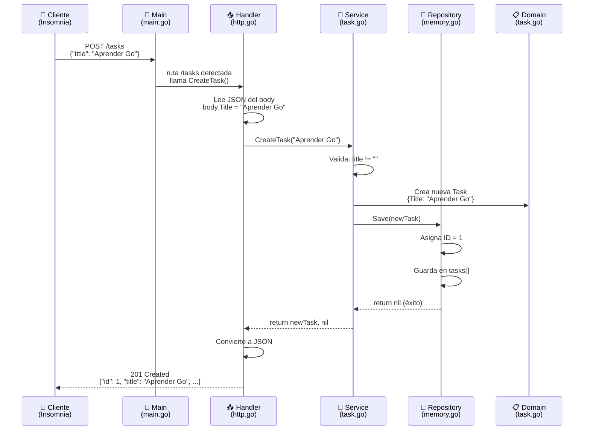
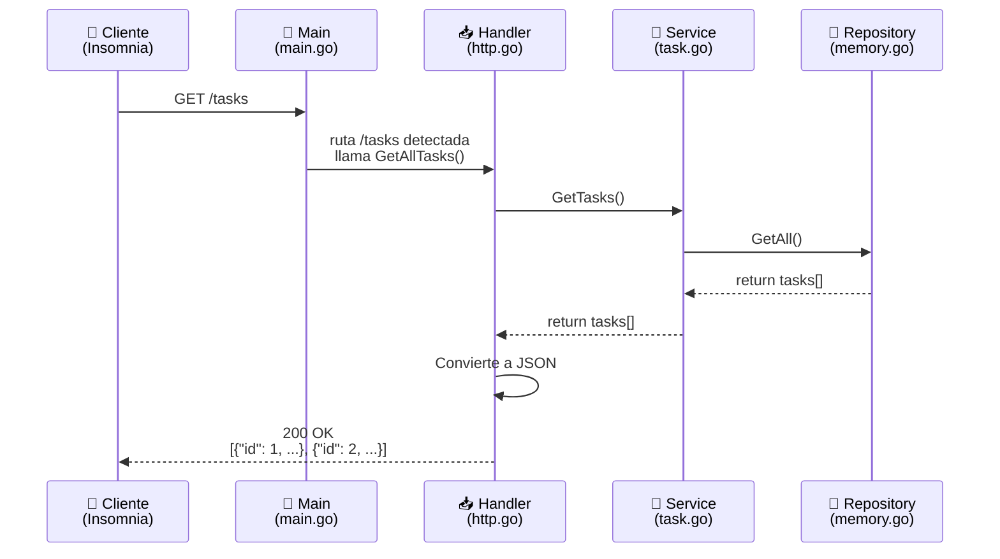
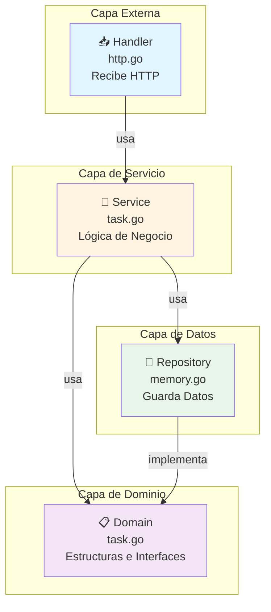
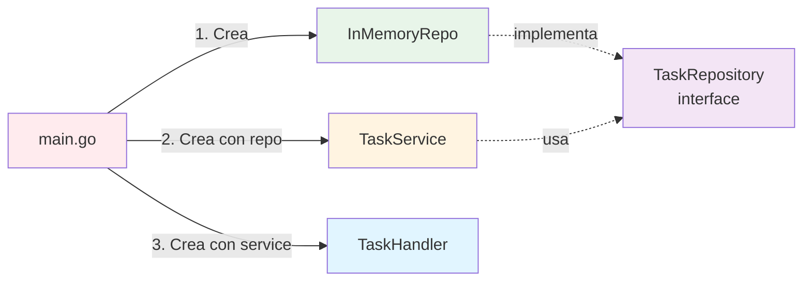
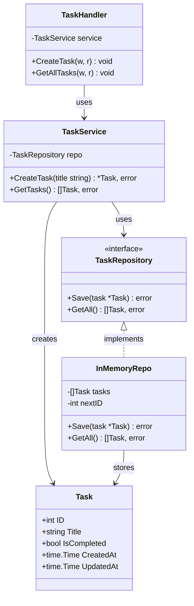

# 🔄 Diagrama de Flujo - Arquitectura Clean

## Flujo Completo: Crear una Tarea



## Flujo Completo: Obtener Todas las Tareas



## Arquitectura en Capas



## Inyección de Dependencias



## Estructura de Datos



## Flujo de Datos: Crear Tarea

```
┌─────────────────────────────────────────────────────────────┐
│                    DATOS ENTRANTES                          │
│                                                               │
│  HTTP Request:                                               │
│  POST /tasks                                                 │
│  Content-Type: application/json                             │
│  Body: {"title": "Aprender Go"}                             │
└───────────────────────────┬─────────────────────────────────┘
                            │
                            ▼
┌─────────────────────────────────────────────────────────────┐
│                    HANDLER (Conversión)                      │
│                                                               │
│  Input:  HTTP Request                                        │
│  Output: body.Title = "Aprender Go" (string)                │
└───────────────────────────┬─────────────────────────────────┘
                            │
                            ▼
┌─────────────────────────────────────────────────────────────┐
│                    SERVICE (Lógica)                         │
│                                                               │
│  Input:  "Aprender Go" (string)                             │
│  Proceso:                                                    │
│    • Valida: title != "" ✅                                 │
│    • Crea: Task{Title: "Aprender Go", IsCompleted: false}   │
│  Output: *Task (puntero)                                    │
└───────────────────────────┬─────────────────────────────────┘
                            │
                            ▼
┌─────────────────────────────────────────────────────────────┐
│                    REPOSITORY (Persistencia)                 │
│                                                               │
│  Input:  *Task (sin ID)                                      │
│  Proceso:                                                    │
│    • Asigna ID = 1                                          │
│    • Guarda en []Task                                        │
│  Output: Task guardada con ID                                │
└───────────────────────────┬─────────────────────────────────┘
                            │
                            ▼
┌─────────────────────────────────────────────────────────────┐
│                    DATOS SALIENTES                          │
│                                                               │
│  HTTP Response:                                              │
│  Status: 201 Created                                         │
│  Content-Type: application/json                              │
│  Body: {                                                     │
│    "id": 1,                                                  │
│    "title": "Aprender Go",                                   │
│    "is_completed": false,                                    │
│    "created_at": "0001-01-01T00:00:00Z",                    │
│    "updated_at": "0001-01-01T00:00:00Z"                      │
│  }                                                           │
└─────────────────────────────────────────────────────────────┘
```

## Comparación: Con vs Sin Clean Architecture

### ❌ Sin Clean Architecture (Todo mezclado)
```
┌─────────────────────────────────────┐
│         Un solo archivo             │
│                                     │
│  • Recibe HTTP                      │
│  • Valida datos                     │
│  • Guarda en base de datos          │
│  • Responde HTTP                    │
│                                     │
│  Problemas:                         │
│  • Difícil de probar                │
│  • Difícil de cambiar               │
│  • Todo acoplado                    │
└─────────────────────────────────────┘
```

### ✅ Con Clean Architecture (Separado)
```
┌──────────────┐
│   Handler    │ ← Solo HTTP
└──────┬───────┘
       │
┌──────▼───────┐
│   Service    │ ← Solo lógica
└──────┬───────┘
       │
┌──────▼───────┐
│  Repository  │ ← Solo datos
└──────────────┘

Ventajas:
• Fácil de probar cada capa
• Fácil de cambiar implementación
• Código organizado y mantenible
```

---

## 📊 Resumen Visual

```
┌─────────────────────────────────────────────────────────────┐
│                         CLIENTE                              │
│                    (Insomnia/Postman)                        │
└───────────────────────────┬─────────────────────────────────┘
                            │ HTTP Request/Response
                            ▼
┌─────────────────────────────────────────────────────────────┐
│  MAIN (main.go)                                             │
│  • Crea todas las dependencias                              │
│  • Registra rutas                                           │
│  • Arranca servidor                                         │
└───────────────────────────┬─────────────────────────────────┘
                            │
        ┌───────────────────┴───────────────────┐
        │                                       │
        ▼                                       ▼
┌───────────────┐                      ┌───────────────┐
│   HANDLER     │                      │   HANDLER     │
│  CreateTask   │                      │  GetAllTasks  │
└───────┬───────┘                      └───────┬───────┘
        │                                       │
        └───────────────┬───────────────────────┘
                        │
                        ▼
                ┌───────────────┐
                │    SERVICE    │
                │  TaskService  │
                └───────┬───────┘
                        │
                        ▼
                ┌───────────────┐
                │  REPOSITORY   │
                │ InMemoryRepo  │
                └───────┬───────┘
                        │
                        ▼
                ┌───────────────┐
                │    DOMAIN     │
                │  Task struct  │
                │  Interface    │
                └───────────────┘
```

---

**Nota:** Estos diagramas muestran cómo las diferentes capas se comunican entre sí. Cada flecha representa una llamada o dependencia entre componentes.


